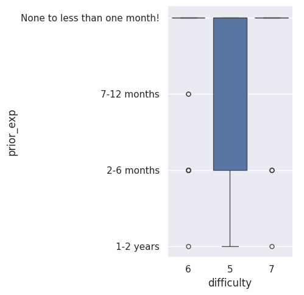
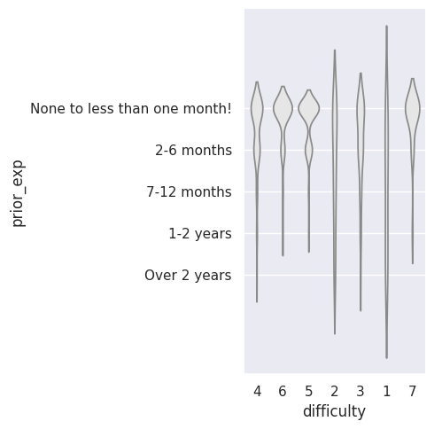
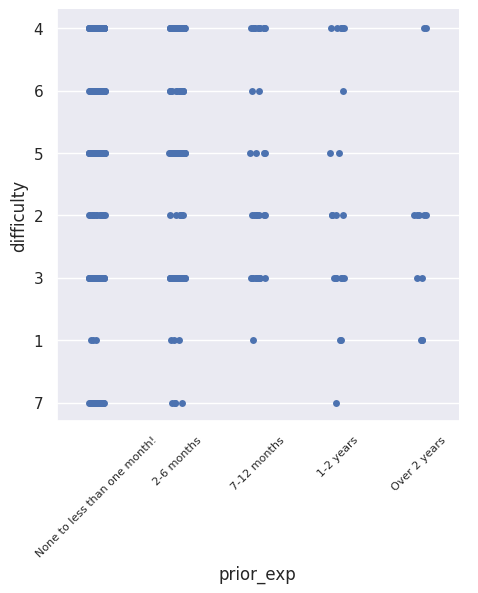

---
# Do not edit the text between these lines!
layout: default
---

# Cameron and Sophia's Project

<!-- This is a comment. Below, you'll see code for inserting an image. To make this image appear, update <custom-path>. To add an image, save it inside the imgs folder of this repository. -->

## Analysis Approach

Out idea that we can analyze with the available data is whether or not COMP110 should offer an optional, pre-semester module to those who want to learn coding before COMP110 to help ease the difficulty of the class for certain students. 

This idea is more valuable than the others brainstormed because we beleive that, given the data presented, with information about students' prerequisite data on coding as well as their percieved difficulty of the class, we would have ample data to help provide analysis. Additionally, this could help the students because it would provide a way to help ease the burden of COMP110 during the semester and would help the instructors because it would allow them to understand the difficulty of their course to the different categories of students with different experience levels. 

A "how hard" function was made to sort and filter out students who thought the course was a 4 or easier. This allowed us to just look at those who beleived the course had an exceedingly difficult level of difficulty (5,6 or 7). A box plot was then made to allow us to see the measures of center and spread of the experience based on difficulty level. 

Continuing on, another graph was made where each difficulty was given a cluster shape to allow us to see where the frequency of experience was for each difficulty level. We can see that the clumps around no experience get larger as difficulty increases. Additionally, as difficulty decreases, you see those with prior experience more frequent. 

We can use this final graph to analyze where each experience level clumps for difficulty in a different way. For example, we see the no one with over two years of experience had a difficulty of over 4. And those with 1-2 years had very few data points over 4 (<5).

## Conclusion 

We believe that, given the above data, we can make a recomendation to create a new, option pre-course module which those with litte-to-no coding experience can do to "soften their landing" into COMP110. Our data above show that that there is a strong divide in percieved difficulty between those with little-to-no experience versus those with strong experience. This, of course, is natural in any course; however, we beleive that in order to create a more equitable course for those with no experience, a way to gain some experience could be beneficial. 

While this could be beneficial to the students, it does propose extra and added work to the instructors. Additionally, it could disrupt the class flow as they could want to teach certain material a certain way. There is a proposed risk of students learning material wrong on their own and coming to class more confused. 

Some limitations of this include the fact that we do not explicity what the difficulty of the course is supposed to be, which is set by the instructors. Given that this is a college course, it is natural that a professor would expect their course to come with some intentional difficulty. 